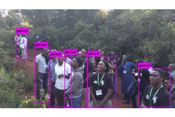

# dsa2018materials
Data Science Africa Nyeri 2018 lab materials

Also included the notebooks for the introductory lectures on computer vision - building a pipeline for processing images/videos

1. [Notebook on basics](computer-vision-basics-tutorial/DSA-2018-Computer Vision.ipynb) of cv using skimage and yolo
2. [YOlO v3 implementation](computer-vision-basics-tutorial/Running Yolo3 with Python.ipynb) 
 in Python
